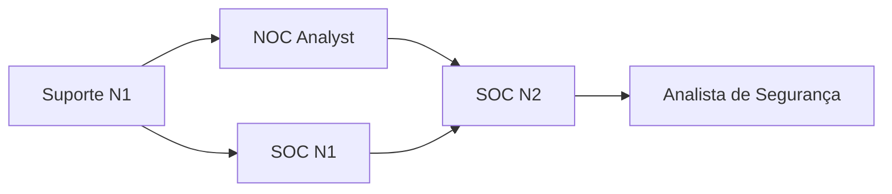

# 📊 Resumo Analítico: Vagas de Suporte e Entrada (N1)

> **Análise baseada em 3 vagas reais** coletadas e estudadas pela Comunidade CyberSec BR

---

## 🎯 Visão Geral do Mercado

Este documento consolida insights, estatísticas e tendências observadas nas vagas de **Suporte Técnico N1** analisadas. O objetivo é fornecer um panorama realista do que o mercado espera de profissionais iniciantes e como estas posições servem de trampolim para a cibersegurança.

---

## 💰 Faixa Salarial

| Estatística | Valor |
|-------------|-------|
| **Média Salarial** | R$ 3.300 |
| **Menor Salário Identificado** | R$ 3.000 (+ R$ 300 ajuda de custo) |
| **Maior Salário Identificado** | R$ 3.300 |
| **Observação** | 66% das vagas não informam salário |

### 💡 Insights Salariais
- A maioria das vagas **não divulga o salário** abertamente
- Faixa esperada para N1: **R$ 2.500 a R$ 4.000**
- Benefícios comuns: Vale-refeição, ajuda de custo, plano de saúde
- Contratos PJ tendem a ter valores 30-50% maiores que CLT (sem benefícios)

---

## 📍 Modalidade de Trabalho

```
🏠 100% Remoto      ▓▓▓▓▓▓▓▓▓▓▓▓▓▓▓░ 66%
🏢 Híbrido          ▓▓▓▓▓░░░░░░░░░░ 17%
🌍 Presencial → Remoto ▓▓▓▓▓░░░░░░░░░░ 17%
```

### 💡 Insights de Modalidade
- **Tendência forte de trabalho remoto** (83% permitem remoto total ou parcial)
- Apenas 1 vaga exige presencial temporário (3 meses em Cláudio/MG)
- Empresas de fintech e marketing digital preferem 100% remoto
- Telecomunicações ainda mantêm modelo híbrido ou presencial inicial

---

## 📜 Tipo de Contrato

```
CLT                 ▓▓▓▓▓▓▓▓▓▓░░░░░ 33%
PJ                  ░░░░░░░░░░░░░░░ 0%
Não Especificado    ▓▓▓▓▓▓▓▓▓▓▓▓▓▓▓ 67%
```

### 💡 Insights de Contratação
- **67% das vagas não especificam** o tipo de contrato no anúncio
- Das especificadas, 100% são **CLT** (sinal positivo para iniciantes)
- É **fundamental perguntar** sobre o tipo de contrato na primeira entrevista
- Vagas CLT oferecem mais estabilidade para estudar e planejar a carreira

---

## 🛠️ Tecnologias e Ferramentas Mais Demandadas

### 🥇 Top 5 Ferramentas (por frequência)

| # | Ferramenta/Tecnologia | Categoria | % Vagas | Importância para CyberSec |
|---|----------------------|-----------|---------|---------------------------|
| 1 | **Zendesk / Jira** | Gestão de Tickets | 66% | ⭐⭐⭐⭐⭐ Essencial para gestão de incidentes |
| 2 | **Zabbix / Grafana** | Monitoramento | 33% | ⭐⭐⭐⭐⭐ Base para SIEM e SOC |
| 3 | **Ferramentas de Diagnóstico** (ping, tracert, MTR) | Redes | 66% | ⭐⭐⭐⭐⭐ Fundamentais para análise de rede |
| 4 | **APIs e Integrações** (Make, Zapier) | Automação | 33% | ⭐⭐⭐⭐ Ponte para AppSec e API Security |
| 5 | **Inglês Técnico** | Idioma | 33% | ⭐⭐⭐⭐⭐ Obrigatório para crescimento |

### 📦 Categorização de Habilidades

#### 🔵 **Hard Skills Técnicas**
- **Redes:** Protocolos TCP/IP, diagnóstico de conectividade, análise de tráfego
- **Sistemas:** Windows, Linux (básico), configuração de servidores
- **Ferramentas:** Zendesk, Jira, Zabbix, Grafana, Postman
- **Programação:** Lógica de programação, noções de Python/PowerShell (diferencial)

#### 🟢 **Soft Skills Valorizadas**
- **Comunicação clara** (explicar problemas técnicos para não-técnicos)
- **Resolução de problemas** (troubleshooting metódico)
- **Gestão de múltiplas demandas** (priorização)
- **Trabalho sob pressão** (casos críticos)
- **Proatividade** (documentação, melhoria de processos)

---

## 🎓 Formação Acadêmica Exigida

```
Ensino Superior Completo    ░░░░░░░░░░░░░░░ 0%
Superior em Andamento       ▓▓▓▓▓▓▓▓▓▓▓▓▓▓▓ 66%
Ensino Técnico              ▓▓▓▓▓▓▓▓▓▓░░░░░ 66%
Não Especificado            ▓▓▓▓▓░░░░░░░░░░ 33%
```

### 💡 Insights de Formação
- **Não é necessário graduação completa** para vagas N1
- Ensino técnico em TI é **altamente valorizado**
- Graduação em andamento (Ciência da Computação, Análise de Sistemas) é um **diferencial**
- Certificações técnicas podem **substituir** a falta de diploma formal

---

## 🏢 Setores que Mais Contratam

| Setor | % Vagas | Características | Oportunidades de Migração |
|-------|---------|-----------------|---------------------------|
| **Telecomunicações** | 33% | NOC, monitoramento de rede, disponibilidade | ⭐⭐⭐⭐⭐ Caminho direto para SOC |
| **Fintech/Investech** | 33% | Suporte a plataformas financeiras, regulação | ⭐⭐⭐⭐⭐ FinSec é área aquecida |
| **Marketing Digital/SaaS** | 33% | Automação, APIs, integrações | ⭐⭐⭐⭐ Ponte para AppSec |

### 💡 Insights Setoriais
- **Fintech:** Maior maturidade em segurança, regulações rígidas (LGPD, PCI-DSS)
- **Telecomunicações:** Foco em disponibilidade e performance, infraestrutura crítica
- **Marketing Digital:** APIs e integrações são a alma do negócio (API Security)

---

## ⏰ Carga Horária e Jornada

| Tipo de Jornada | % Vagas | Observações |
|-----------------|---------|-------------|
| Comercial (8h-18h) | 33% | Mais comum em empresas de automação |
| Turno Noturno (17h-02h) | 33% | Comum em suporte internacional |
| Escala 5x2 | 33% | Padrão para operações 24/7 |
| Sábados alternados | 33% | Atenção: pode impactar estudos |

### ⚠️ Pontos de Atenção
- Jornadas noturnas podem **dificultar networking** e participação em eventos
- Trabalho aos sábados reduz tempo para **cursos e certificações**
- Escalas 24/7 podem causar **burnout** se não houver gestão de energia

---

## 📈 Áreas de Cibersegurança Mais Acessíveis

### 🎯 **Caminho Recomendado de Migração**



| Origem | Destino | Tempo Médio | Dificuldade | Certificações Chave |
|--------|---------|-------------|-------------|---------------------|
| Suporte N1 | **SOC N1** | 12-18 meses | ⭐⭐⭐ | Security+, CySA+ |
| Suporte N1 (Telecom) | **NOC Analyst** | 6-12 meses | ⭐⭐ | Network+, CCNA |
| Suporte N1 (APIs) | **AppSec Junior** | 18-24 meses | ⭐⭐⭐⭐ | Security+, OWASP |
| NOC Analyst | **SOC N2** | 12-18 meses | ⭐⭐⭐ | CySA+, CEH |

### 🚀 **Áreas Mais Fomentadas**
1. **Blue Team / SOC** (Defesa, Monitoramento, Resposta a Incidentes)
2. **Network Security** (Firewall, IDS/IPS, Segmentação)
3. **API Security** (Segurança de Integrações e Microsserviços)

### ⚠️ **Áreas Menos Acessíveis Diretamente**
- Red Team / Pentest (exige anos de experiência)
- Malware Analysis (exige background forte em programação)
- Security Architecture (nível sênior/especialista)

---

## 🎯 Top 5 Certificações Recomendadas

| # | Certificação | Nível | Custo (USD) | ROI para Migração | Validade |
|---|--------------|-------|-------------|-------------------|----------|
| 1 | **CompTIA Security+** | Entry | ~$400 | ⭐⭐⭐⭐⭐ | 3 anos |
| 2 | **CompTIA Network+** | Entry | ~$350 | ⭐⭐⭐⭐⭐ | 3 anos |
| 3 | **CompTIA A+** | Entry | ~$250 | ⭐⭐⭐ | 3 anos |
| 4 | **CompTIA CySA+** | Intermediate | ~$400 | ⭐⭐⭐⭐⭐ | 3 anos |
| 5 | **Cisco CCNA** | Intermediate | ~$300 | ⭐⭐⭐⭐ | 3 anos |

### 💡 Ordem Recomendada de Estudo
1. **CompTIA A+** → Fundamentos de TI
2. **CompTIA Network+** → Fundamentos de Redes
3. **CompTIA Security+** → Fundamentos de Segurança ✅ **Ponto de virada**
4. **CompTIA CySA+** ou **Cisco CyberOps** → Análise de Segurança

---

## 🌍 Distribuição Geográfica

### 📍 Regiões com Mais Vagas

```
🏠 Remoto (qualquer lugar)  ▓▓▓▓▓▓▓▓▓▓▓▓▓▓▓ 66%
🌆 Sudeste (SP, RJ, MG)     ▓▓▓▓▓▓▓▓▓▓░░░░░ 33%
🌴 Sul (RS, SC)             ▓▓▓▓▓░░░░░░░░░░ 17%
```

### 💡 Insights Geográficos
- **Trabalho remoto domina** o mercado para N1
- Sudeste (especialmente SP) concentra empresas de tecnologia
- Região Sul tem forte presença de fintechs e investechs
- Não há barreiras geográficas significativas para iniciar a carreira

---

## 🚩 Red Flags Identificadas

### ⛔ **Bandeiras Vermelhas Críticas**
- ❌ Exigência de **realocação geográfica** sem suporte adequado
- ❌ Tipo de contrato **"não especificado"** (66% das vagas!)
- ❌ Carga horária **"em constante mudança"** (risco de burnout)
- ❌ Salário PJ sem 30-50% de acréscimo sobre CLT

### ⚠️ **Bandeiras Amarelas (Pontos de Atenção)**
- ⚠️ Trabalho em **sábados alternados** (impacta estudos)
- ⚠️ Turno **noturno** (17h-02h) dificulta networking
- ⚠️ "Alta demanda" e "múltiplos chats simultâneos" (estresse)
- ⚠️ Foco exclusivo em **performance/disponibilidade** (não em segurança)

---

## ✅ Green Flags Identificadas

### 💚 **Oportunidades Excelentes**
- ✅ **Contrato CLT** com benefícios (estabilidade para estudar)
- ✅ **100% remoto** (flexibilidade, economia de tempo/dinheiro)
- ✅ Setor **financeiro ou telecom** (alta maturidade em segurança)
- ✅ Uso de **Zendesk/Jira** (ferramentas padrão de mercado)
- ✅ Contato com **APIs e integrações** (ponte para AppSec)
- ✅ Contato com **Zabbix/Grafana** (ponte para SOC/SIEM)
- ✅ Exigência de **inglês** (força a desenvolver habilidade essencial)

---

## 📚 Roteiro de Estudos Consolidado

### 🎯 **Fase 1: Fundamentos (0-6 meses)**
**Objetivo:** Dominar o trabalho de suporte N1 e construir base técnica sólida

- ✅ Estudar para **CompTIA A+** (hardware, SO, troubleshooting)
- ✅ Estudar para **CompTIA Network+** (TCP/IP, protocolos, topologias)
- ✅ Praticar com **Packet Tracer** (simulador de redes Cisco)
- ✅ Aprender **Linux básico** (terminal, comandos essenciais)
- ✅ Dominar **Zendesk/Jira** no trabalho
- ✅ Criar conta no **GitHub** e começar a documentar aprendizados

### 🎯 **Fase 2: Ponte para Segurança (6-12 meses)**
**Objetivo:** Desenvolver mentalidade de segurança e aplicar no trabalho atual

- ✅ Estudar para **CompTIA Security+** 🎯 **CERTIFICAÇÃO CHAVE**
- ✅ Montar um **home lab** (VirtualBox/VMware com Kali Linux e Metasploitable)
- ✅ Estudar **OWASP Top 10** (se trabalha com APIs)
- ✅ Estudar **OWASP API Security Top 10** (para vaga de automação)
- ✅ Aprender **Python** ou **PowerShell** (scripting básico)
- ✅ Participar de **CTFs gratuitos** (PicoCTF, TryHackMe Free)
- ✅ Começar a aplicar **mentalidade de segurança** no dia a dia do trabalho

### 🎯 **Fase 3: Transição Ativa (12-24 meses)**
**Objetivo:** Se posicionar como candidato a vagas júnior de cibersegurança

- ✅ Estudar para **CompTIA CySA+** ou **Cisco CyberOps Associate**
- ✅ Montar **SIEM no home lab** (Wazuh, Elastic Security, Splunk Free)
- ✅ Criar **projetos para portfólio** (análise de pcaps, scripts, mini-labs)
- ✅ Fazer **networking intenso** com time de segurança da empresa
- ✅ Candidatar-se a **vagas internas** de SOC N1 ou Segurança Júnior
- ✅ Contribuir com **comunidades** (CyberSec BR, Discord, GitHub)
- ✅ Documentar **tudo** em um blog ou GitHub Pages

---

## 🎓 Recursos de Aprendizado Recomendados

### 📖 **Guias da Comunidade CyberSec BR**
- [Por Onde Começar em Cibersegurança](../../guias/materiais-de-estudo/por-onde-comecar.md)
- [Trilha de Estudos: Blue Team](../../guias/materiais-de-estudo/trilha-blue-team.md)
- [Guia de Certificações](../../guias/carreira/certificacoes.md)

### 🌐 **Plataformas Gratuitas**
- **TryHackMe** (módulo SOC Level 1)
- **HackTheBox Academy** (módulos gratuitos)
- **CyberDefenders** (desafios de Blue Team)
- **Malware-Traffic-Analysis.net** (análise de pcaps)

### 📚 **Livros Essenciais**
- "CompTIA Security+ Get Certified Get Ahead" - Darril Gibson
- "The Practice of Network Security Monitoring" - Richard Bejtlich
- "Blue Team Handbook" - Don Murdoch

---

## 🎯 Conclusão e Recomendações Finais

### ✅ **Para Iniciantes Absolutos**
Se você **não tem experiência em TI**:
1. Aceite uma vaga de Suporte N1 (qualquer uma das analisadas é válida)
2. Foque em **ser excelente** no seu trabalho atual (6 meses)
3. Estude **Network+** e **Security+** em paralelo
4. Reavalie sua posição após 12 meses

### ✅ **Para Quem Já Trabalha em Suporte**
Se você **já está em uma vaga similar**:
1. Comece a aplicar **mentalidade de segurança** imediatamente
2. Priorize a certificação **Security+** nos próximos 3-6 meses
3. Monte um **home lab** e crie **1 projeto de portfólio**
4. Candidate-se a vagas de **SOC N1** após 12 meses

### ✅ **Melhor Vaga Desta Categoria**
🏆 **Suporte N1 em Fintech (Investech)** porque:
- Setor regulado com alta maturidade em segurança
- Exige inglês (habilidade essencial)
- Contrato CLT (estabilidade)
- Grande potencial de mobilidade interna

---

## 📊 Estatísticas Rápidas

```
📌 Total de Vagas Analisadas: 3
💰 Média Salarial (informada): R$ 3.300
🏠 Vagas Remotas: 83%
📜 Vagas CLT: 33% (67% não especificaram)
🌍 Setores: 33% Telecom | 33% Fintech | 33% Marketing Digital
🎓 Exige Graduação Completa: 0%
⏰ Média de Tempo para Migração: 12-24 meses
🎯 Certificação #1 Recomendada: CompTIA Security+
```

---

## 🔗 Links Úteis

- [⬅️ Voltar para índice da pasta](./README.md)
- [🏠 Análise de Mercado - Página Principal](../README.md)
- [📚 Materiais de Estudo](../../guias/materiais-de-estudo/)
- [💼 Guias de Carreira](../../guias/carreira/)

---

## 📝 Sobre Este Documento

### Metodologia de Criação

Este documento foi gerado através de **análise consolidada** de todas as vagas desta categoria usando inteligência artificial (LLM) para extrair insights, estatísticas e tendências de forma objetiva e baseada em dados reais.

**Como este RESUMO foi criado:**
1. ✅ Todas as análises de vaga da categoria foram compiladas
2. ✅ Um prompt estruturado foi usado para análise estatística
3. ✅ Os dados foram validados manualmente contra as análises originais
4. ✅ Insights e recomendações foram refinados pela comunidade

**Quer atualizar este RESUMO ou criar um novo?**
- 📖 Consulte o [Guia de Contribuição - Seção RESUMO.md](../../CONTRIBUINDO.md#-como-geraratualizar-um-resumomd)
- 🤖 Use o prompt estruturado fornecido no guia
- ✔️ Valide todos os dados contra as análises originais
- 🔀 Faça um Pull Request com as atualizações

---

📅 **Última Atualização:** Outubro de 2025
📝 **Contribuições:** Este resumo é construído colaborativamente. [Contribua com novas análises!](../../CONTRIBUINDO.md)
🤖 **Metodologia:** [Ver como este documento foi gerado](../../CONTRIBUINDO.md#-como-geraratualizar-um-resumomd)
