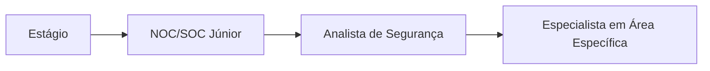

# 📊 Resumo Analítico: Vagas de Estágio em Cibersegurança

> **Análise baseada em 4 vagas reais** coletadas e estudadas pela Comunidade CyberSec BR

---

## 🎯 Visão Geral do Mercado

Este documento consolida insights, estatísticas e tendências observadas nas vagas de **Estágio em Cibersegurança** analisadas. O objetivo é fornecer um panorama realista do que o mercado espera de estudantes e como estas posições servem de trampolim para carreiras em segurança.

---

## 💰 Faixa Salarial

| Estatística | Valor |
|-------------|-------|
| **Média Salarial** | R$ 1.200 |
| **Menor Salário Identificado** | R$ 1.200 (bolsa auxílio) |
| **Maior Salário Identificado** | R$ 1.200 |
| **Observação** | 75% das vagas não informam salário |

### 💡 Insights Salariais
- Bolsas de estágio em segurança da informação tendem a ser padronizadas
- Benefícios complementares importantes: Vale-refeição, plano de saúde
- Possibilidade de efetivação após o período de estágio
- Salário pode variar conforme região e tamanho da empresa

---

## 📍 Modalidade de Trabalho

```
🏠 Remoto                     ▓▓▓▓▓▓▓▓░░░░░░ 25%
🏢 Híbrido                   ▓▓▓▓▓▓▓▓▓░░░░░ 25%
🌍 Presencial                ▓▓▓▓▓▓▓▓▓▓░░░░ 50%
```

### 💡 Insights de Modalidade
- **Presencial ainda domina** para estágios em segurança
- Empresas de tecnologia oferecem maior flexibilidade
- Startups tendem a adotar modelos híbridos
- Regiões metropolitanas concentram maior número de vagas

---

## 📜 Tipo de Contrato

```
Estágio CLT             ▓▓▓▓▓▓▓▓▓▓▓▓▓▓▓ 100%
PJ                      ░░░░░░░░░░░░░░░ 0%
```

### 💡 Insights de Contratação
- 100% das vagas são formalmente de estágio
- Seguem legislação de estágio (Lei 11.788/2008)
- Exigem matrícula e frequência escolar
- Possibilidade de bolsa-auxílio e benefícios

---

## 🛠️ Tecnologias e Ferramentas Mais Demandadas

### 🥇 Top 5 Ferramentas (por frequência)

| # | Ferramenta/Tecnologia | Categoria | % Vagas | Importância para CyberSec |
|---|----------------------|-----------|---------|---------------------------|
| 1 | **ISO 27001** | Frameworks | 75% | ⭐⭐⭐⭐⭐ Fundamentos de Segurança |
| 2 | **Zabbix/SIEM** | Monitoramento | 50% | ⭐⭐⭐⭐ Base para SOC |
| 3 | **TryHackMe/HackTheBox** | Plataformas de Estudo | 50% | ⭐⭐⭐⭐ Desenvolvimento Prático |
| 4 | **Visio/Lucidchart** | Documentação | 25% | ⭐⭐⭐ Mapeamento de Processos |
| 5 | **NIST/CIS Controls** | Frameworks | 25% | ⭐⭐⭐⭐ Práticas de Segurança |

### 📦 Categorização de Habilidades

#### 🔵 **Hard Skills Técnicas**
- **Fundamentos:** Tríade CIA, Frameworks de Segurança
- **Sistemas:** Conhecimento básico de Windows/Linux
- **Documentação:** Mapeamento de processos, elaboração de relatórios
- **Estudos:** Plataformas de treinamento prático

#### 🟢 **Soft Skills Valorizadas**
- **Aprendizado Contínuo**
- **Comunicação Clara**
- **Proatividade**
- **Trabalho em Equipe**
- **Curiosidade Técnica**

---

## 🎓 Formação Acadêmica Exigida

```
Ensino Superior Cursando    ▓▓▓▓▓▓▓▓▓▓▓▓▓▓▓ 100%
Áreas Predominantes:
  🖥️ Ciência da Computação   ▓▓▓▓▓▓▓▓▓▓░░░░ 75%
  🛡️ Segurança da Informação ▓▓▓▓▓▓░░░░░░░░ 50%
  📊 Análise de Sistemas      ▓▓▓▓▓░░░░░░░░░ 25%
```

### 💡 Insights de Formação
- **Graduação em andamento** é requisito essencial
- Cursos de TI são os mais valorizados
- Segurança da Informação como curso ganha destaque
- Possibilidade de alunos de diferentes períodos

---

## 🏢 Setores que Mais Contratam

| Setor | % Vagas | Características | Oportunidades de Migração |
|-------|---------|-----------------|---------------------------|
| **Tecnologia e Serviços** | 50% | Startups, empresas de médio porte | ⭐⭐⭐⭐ Múltiplas possibilidades |
| **Setor Aeroespacial** | 25% | Alta complexidade, processos maduros | ⭐⭐⭐⭐⭐ Excelente formação |
| **Empresas Regionais** | 25% | Foco em GRC, processos internos | ⭐⭐⭐ Desenvolvimento em governança |

### 💡 Insights Setoriais
- Setor de tecnologia domina mercado de estágios
- Empresas com processos maduros oferecem melhor aprendizado
- Setores como aeroespacial valorizam rigor técnico

---

## 🎯 Caminhos de Migração



| Origem | Destino | Tempo Médio | Dificuldade | Certificações Chave |
|--------|---------|-------------|-------------|---------------------|
| Estágio | **SOC Júnior** | 12-18 meses | ⭐⭐ | Security+ |
| Estágio (Gov. de TI) | **GRC Júnior** | 18-24 meses | ⭐⭐⭐ | ISO 27001 Foundation |
| Estágio (Aeroespacial) | **Analista de Segurança** | 24-36 meses | ⭐⭐⭐⭐ | CISSP (longo prazo) |

---

## 📈 Top 5 Certificações Recomendadas

| # | Certificação | Nível | Custo (USD) | ROI para Migração | Validade |
|---|--------------|-------|-------------|-------------------|----------|
| 1 | **CompTIA Security+** | Entry | ~$400 | ⭐⭐⭐⭐⭐ | 3 anos |
| 2 | **ISO 27001 Foundation** | Entry | ~$250 | ⭐⭐⭐⭐ | Permanente |
| 3 | **CompTIA CySA+** | Intermediate | ~$400 | ⭐⭐⭐⭐ | 3 anos |
| 4 | **ISACA CISM Foundation** | Intermediate | ~$500 | ⭐⭐⭐ | Permanente |
| 5 | **ITIL Foundation** | Entry | ~$300 | ⭐⭐⭐ | Permanente |

### 💡 Ordem Recomendada de Estudo
1. **CompTIA Security+** → Fundamentos de Segurança
2. **ISO 27001 Foundation** → Fundamentos de Gestão
3. **ITIL Foundation** → Processos de TI

---

## 🌍 Distribuição Geográfica

```
🏠 Presencial - SP/RJ     ▓▓▓▓▓▓▓▓▓▓▓▓▓░░ 75%
🌐 Outras Regiões        ▓▓▓▓▓░░░░░░░░░░ 25%
```

### 💡 Insights Geográficos
- Sudeste concentra 75% das vagas
- São Paulo e Rio de Janeiro lideram
- Mercado nacional começa a se descentralizar
- Trabalho remoto aumenta possibilidades geográficas

---

## 🚩 Red Flags Identificadas

### ⛔ **Bandeiras Vermelhas Críticas**
- ❌ Ausência de supervisão técnica
- ❌ Escopo de trabalho muito amplo/vago
- ❌ Baixa oferta de aprendizado estruturado
- ❌ Falta de definição clara de responsabilidades

### ⚠️ **Bandeiras Amarelas (Pontos de Atenção)**
- ⚠️ Modalidade presencial em período de pandemia
- ⚠️ Salário fixo sem possibilidade de variáveis
- ⚠️ Ausência de programa de mentoria
- ⚠️ Foco excessivo em atividades burocráticas

---

## ✅ Green Flags Identificadas

### 💚 **Oportunidades Excelentes**
- ✅ Empresas com processos de segurança maduros
- ✅ Possibilidade de efetivação
- ✅ Contato com múltiplas áreas de segurança
- ✅ Investimento em treinamento
- ✅ Ambiente de aprendizado colaborativo
- ✅ Exposição a frameworks internacionais

---

## 📚 Roteiro de Estudos Consolidado

### 🎯 **Fase 1: Fundamentos (0-6 meses)**
- Dominar conceitos básicos de segurança
- Completar trilhas básicas em TryHackMe
- Estudar para CompTIA Security+
- Praticar inglês técnico

### 🎯 **Fase 2: Especialização (6-12 meses)**
- Desenvolver projeto prático
- Obter primeira certificação
- Participar de comunidades técnicas
- Criar portfólio no GitHub

### 🎯 **Fase 3: Transição (12-24 meses)**
- Buscar estágio em área de interesse
- Iniciar preparação para próxima certificação
- Desenvolver networking
- Participar de eventos e palestras

---

## 🎓 Conclusão e Recomendações

### ✅ **Para Estudantes**
1. Invista em aprendizado prático
2. Busque estágios com supervisão técnica
3. Desenvolva projetos pessoais
4. Mantenha-se atualizado

### ✅ **Para Empresas**
1. Estruturar programas de estágio
2. Oferecer mentoria técnica
3. Investir em treinamento
4. Criar ambiente de aprendizado

### 🏆 **Melhor Vaga Desta Categoria**
🌟 **Estágio em SOC** - Oferece visão ampla, possibilidade de aprendizado acelerado e contato direto com práticas de segurança.

---

## 📊 Estatísticas Rápidas

```
📌 Total de Vagas Analisadas: 4
💰 Média Salarial: R$ 1.200
🏠 Modalidade Predominante: Presencial (50%)
🎓 Formação: 100% Graduação em Andamento
⏰ Tempo Médio para Transição: 18-24 meses
🎯 Certificação #1 Recomendada: CompTIA Security+
```

---

## 🔗 Links Úteis

- [⬅️ Voltar para índice da pasta](./README.md)
- [🏠 Análise de Mercado - Página Principal](../README.md)
- [📚 Materiais de Estudo](../../guias/materiais-de-estudo/)
- [💼 Guias de Carreira](../../guias/carreira/)

---

📅 **Última Atualização:** Outubro de 2025
📝 **Contribuições:** [Contribua com novas análises!](../../CONTRIBUINDO.md)
🤖 **Metodologia:** Gerado por IA - [Ver como](../../CONTRIBUINDO.md#-como-geraratualizar-um-resumomd)